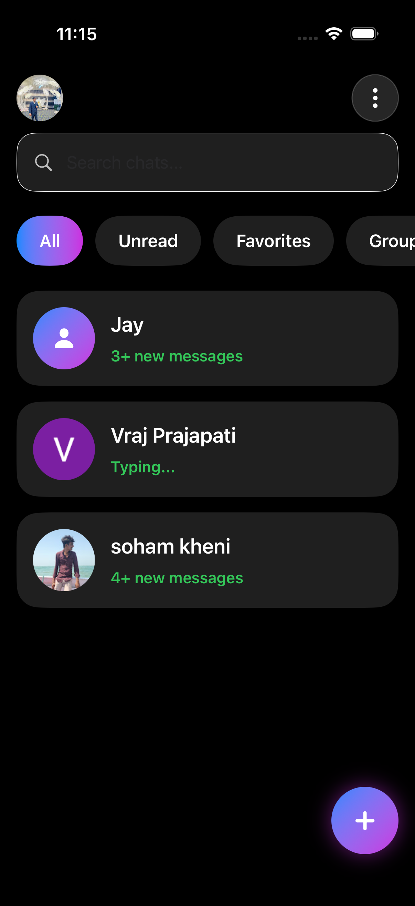
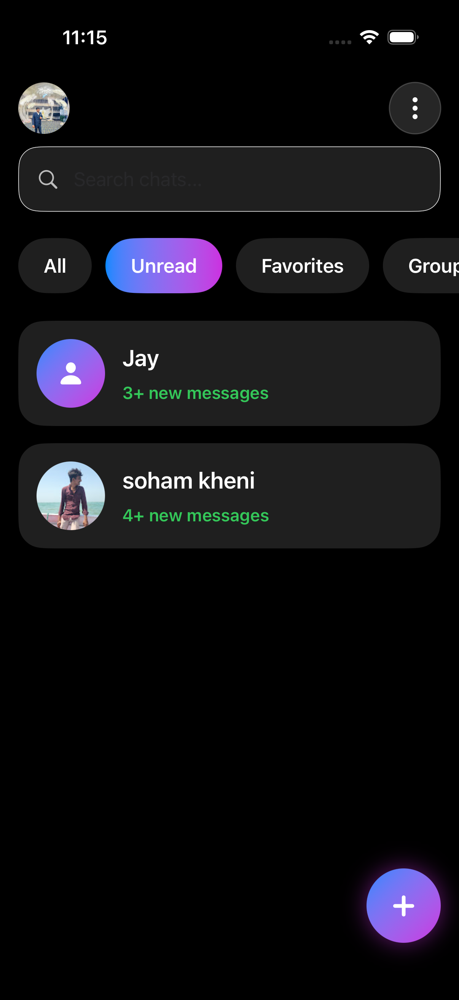
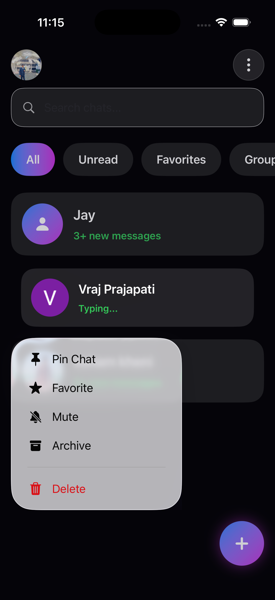
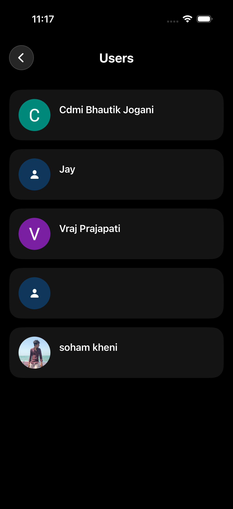
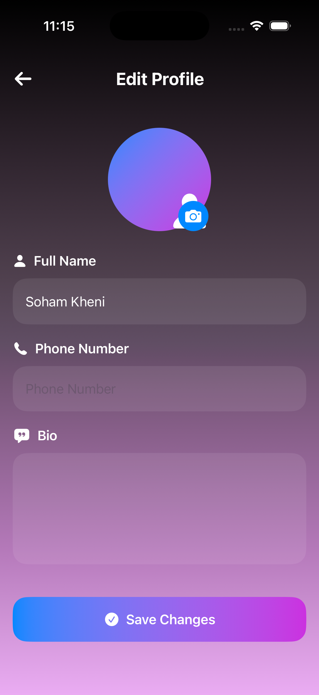

# Connecto - iOS Chat App

A modern real-time chat application built using **SwiftUI**, **Firebase Authentication**, and **Firebase Realtime Database**.

---

## Features

 - User Authentication (Login / Signup) using Firebase Auth
 - Real-time Messaging using Firebase Real-time Database
 - Search Users Functionality
 - Online / Offline Status
 - Typing Indicator
 - Last Message Preview
 - Message Time Display
 - Edit Message Feature
 - Delete Message Feature
 - Pin Chat Option
 - User Profile Screen
 - Edit Profile Page
 - Profile Image Support
 - Beautiful Modern SwiftUI Interface
 - Smooth Navigation & Animations
 - Real-time Data Updates
 - Clean Chat UI Design
 - Dark Theme Styling
 - Responsive Layout for iPhone

---

## Tech Stack

- SwiftUI
- Firebase Auth
- Firebase Real-time Database
- Xcode
- iOS Development
- MVVM Architecture

---

# Screenshots

<p align="center">
  
  
  
</p>

<p align="center">
  
  
  
</p>

<p align="center">
  
  
  
</p>

<p align="center">
  
  
  
</p>
<p align="center">
  
  
</p>

---

## Firebase Setup

1. Create Firebase Project
2. Enable Authentication
3. Enable Email/Password Login
4. Create Real-time Database
5. Add `GoogleService-Info.plist`
6. Install Firebase SDK

---

## Installation

```bash
git clone https://github.com/khenisoham/Connecto.git
```

Open in Xcode and run the project.

---

## Folder Structure

```bash
Connecto
│
├── Views
├── ViewModels
├── Models
├── Services
├── Firebase
└── Assets
```

---

## Author

Soham Kheni

GitHub: [khenisoham](https://github.com/khenisoham)
